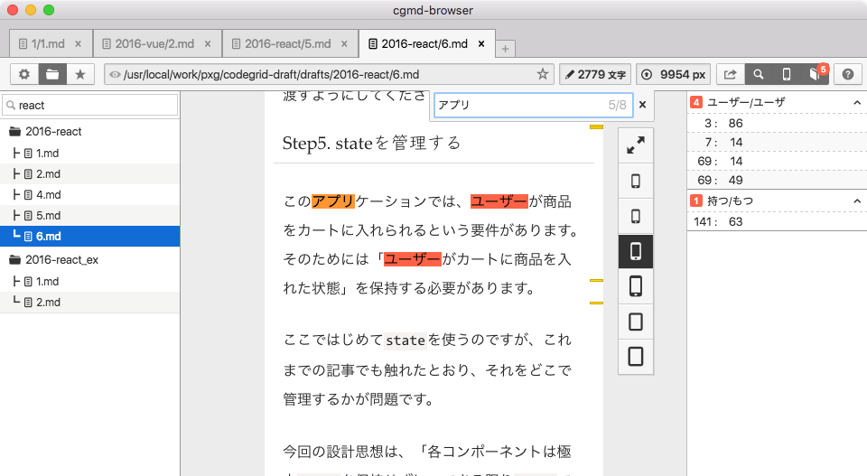

# cgmd-browser

> realtime markdown preview for cgmd-markdown



## Shortcut Key

### Edit

Command|Key 
---|---
Copy| Cmd+C
Paste|Cmd+V
Select All| Cmd+A
Search|Cmd+F

### Tabs

Command|Key 
---|---
Add|Cmd+T
Close|Cmd+W
Open on Editor|Alt+O
Move Right|Ctrl+Tab
Move Left|Ctrl+Shift+Tab
Reload|Ctrl+R

### Favorite

Command|Key 
---|---
Toggle Favorite|Cmd+B
Toggle Favorite List|Cmd+Shift+B

### Finder

Command|Key 
---|---
Set Markdown Directory|Alt+D
Toggle Finder|Cmd+Shift+D
Search on Finder|Cmd+D

### Debug

Command|Key 
---|---
Toggle Textlint Reporter| Cmd+Shift+T
Toggle Viewport Resizer| Cmd+Shift+I
Toggle Developer Tools|Cmd+Alt+I


## Development

Install and run `dev` npm-run-scripts.

```
npm install
# postinstall: cd app && npm install
npm run dev
# start electron app
```

---

This project was generated from [electron-vue](https://github.com/SimulatedGREG/electron-vue) using [vue-cli](https://github.com/vuejs/vue-cli). Documentation about this project can be found [here](https://simulatedgreg.gitbooks.io/electron-vue/content/index.html).
